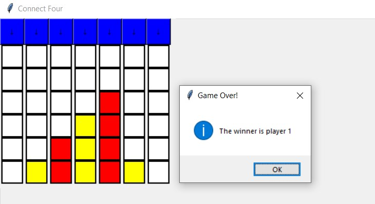

# Connect Four

## Project Overview

This project implements a classic two-player "Connect Four" game. The objective of Connect Four is for players to be the first to form a line of four of their own colored discs, either horizontally, vertically, or diagonally.


## Game Rules

* **Two Players:** The game is designed for two players.
* **Connecting Four:** A player wins by successfully connecting four of their discs in a row.
* **Consecutive Connection:** The four connected slots must be consecutive.
* **Winning Directions:** Connections can be:
    * Horizontal
    * Vertical
    * Diagonal (both positive and negative slopes)
* **Gameplay:** Players take turns dropping discs into one of the available columns. Discs fall to the lowest available space within that column.

## Features

* **Interactive Command-Line Interface:** Play the game directly from your terminal.
* **Dynamic Board Display:** The game board updates after each move.
* **Win Condition Detection:** Automatically detects horizontal, vertical, and diagonal wins.
* **Turn Management:** Handles player turns and input.

## How to Play

### Prerequisites

* Python 3.10 (recommended)

### Running the Game

1.  **Clone the repository:**
    ```bash
    git clone [https://github.com/stevx14/connect_four.git](https://github.com/stevx14/connect_four.git)
    cd connect_four
    ```
   

2.  **Run the game script:**
    ```bash
    python main.py
    ```
    

### In-Game Instructions

* Players will be prompted to enter the column number where they want to drop their disc.
* The game board will be displayed after each move.
* The game will announce the winner when a four-in-a-row connection is made.

## Project Structure
